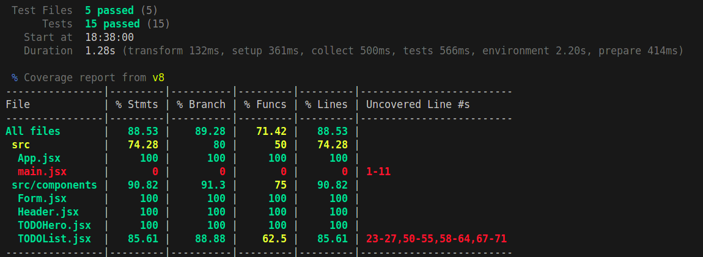

# ✅ Todo List App

A simple and modern Todo List built with **React + Vite**, featuring:

- Task creation
- Task completion tracking
- Inline task editing
- Local storage persistence
- Clean, responsive UI


## 🚀 Features

- 📝 Add, edit, and delete to-dos
- ✅ Mark tasks as completed
- 💾 Data saved in `localStorage` (no backend needed)
- ⚡ Built with **Vite** for fast development
- 🎯 100% client-side


## 🧰 Tech Stack

- [React](https://react.dev/)
- [Vite](https://vitejs.dev/)
- [Testing Library](https://testing-library.com/docs/react-testing-library/intro/)
- [Vitest](https://vitest.dev/) for testing and coverage


## Test Coverage Report

### 🧪 Running Tests

To run tests:
```bash
npm run test
```

To generate a coverage report:
```bash
npm run coverage
```

Below is a screenshot of the current test coverage for the project:

